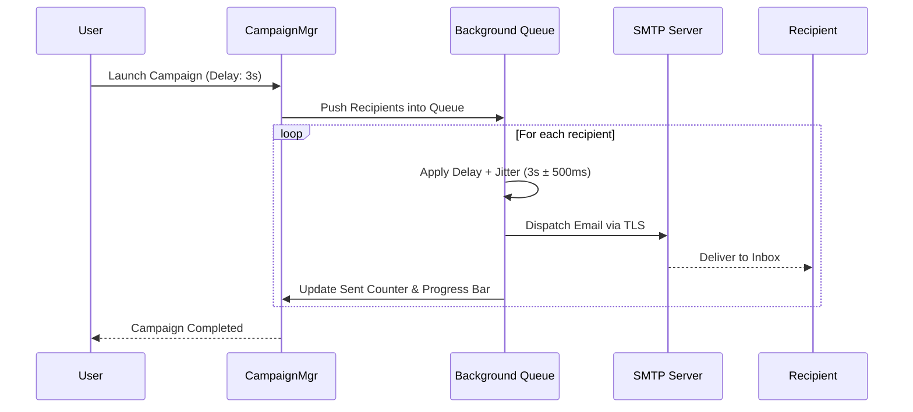

# Phase 6: Campaign Dispatcher, Jitter & Delay Throttle Engine

## 1. Goal Description
Build the core campaign execution engine featuring a 5-step campaign creation wizard, background queue workers (`php artisan queue:work`), and an **advanced Delay & Throttle Engine** with humanized randomized jitter to prevent rate-limiting and avoid spam bot detection by receiving mail servers.

---

## 2. Feature Specifications

### A. 5-Step Campaign Creation Wizard
1. **Step 1: Campaign Details**: Campaign Name, Email Subject Line, Preview Text, Sender Name & Sender Email.
2. **Step 2: SMTP Routing**: Select connected SMTP relay (or round-robin rotation).
3. **Step 3: Audience Selection**: Select target contact list(s) or upload a direct CSV.
4. **Step 4: Template Selection**: Choose an existing template or create a custom layout.
5. **Step 5: Delivery & Delay Settings**:
   - **Send Schedule**: Send Immediately vs. Schedule for future Date & Time.
   - **Wait Delay Between Sends**: Configurable delay per email (e.g. `1s`, `2s`, `5s`, `10s`).
   - **Randomized Jitter (+/- 20%)**: Adds natural variation (e.g. 2s ± 400ms) so sending doesn't look like an automated bot to Gmail/Yahoo filters.
   - **Batch Throttling**: E.g., send 50 emails -> pause 60 seconds -> resume, preventing SMTP server IP rate bans.

### B. Background Queue Dispatcher Architecture
- Campaigns run completely asynchronously in the background via Laravel Queues.
- HTTP requests are never blocked; user can close the browser while campaign dispatches.
- Each email dispatch is an isolated `SendCampaignEmailJob` with retry management and failure capture.

### C. Live Campaign Control & Monitor
- **Real-Time Progress Bar**: E.g. `[████████░░░░░░░░] 50% (500 / 1000 Sent)`.
- **Live Status Controls**:
  - ⏸️ **Pause Campaign**: Temporarily halts queue processing.
  - ▶️ **Resume Campaign**: Continues from the exact last sent recipient.
  - ⏹️ **Cancel / Abort Campaign**: Safely stops remaining jobs.
- **Live Recipient Log Table**: Displays recipient email, status (Sent, Failed), timestamp, and error message if rejected.

---

## 3. Step-by-Step Implementation Tasks
1. Create `campaigns` and `campaign_logs` migrations and models.
2. Build `SendCampaignEmailJob` with dynamic delay calculations, throttle pausing, and exception handling.
3. Build `CampaignController` with 5-step wizard flow.
4. Implement campaign control endpoints (`pause`, `resume`, `cancel`).
5. Build live progress monitoring view with AJAX / Alpine.js auto-refresh.

---

## 4. Verification & Acceptance Criteria
- [ ] Campaign dispatches in the background without blocking the UI.
- [ ] Configured delay between emails (e.g., 2s) is strictly respected by queue jobs.
- [ ] Pause and Resume controls immediately halt and restart queue jobs without skipping or duplicating recipients.
