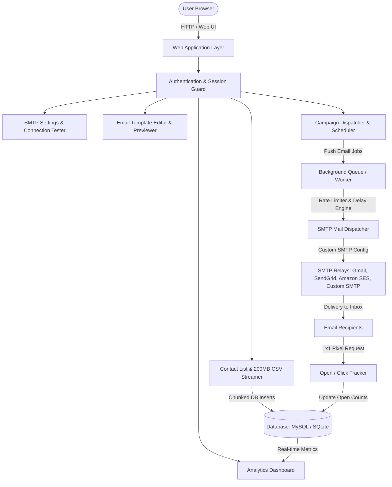
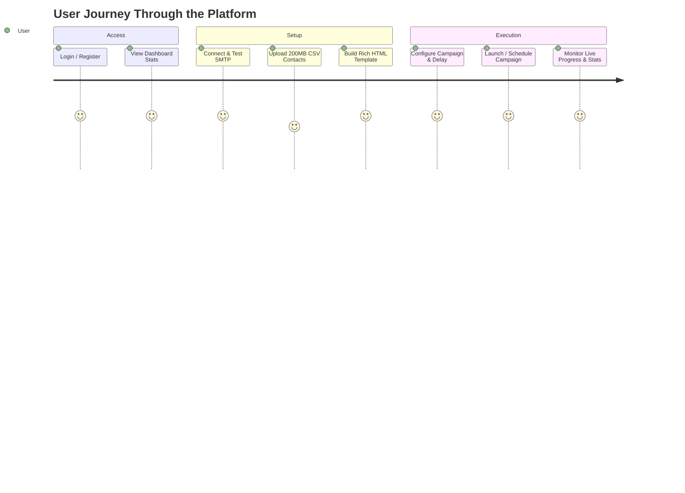
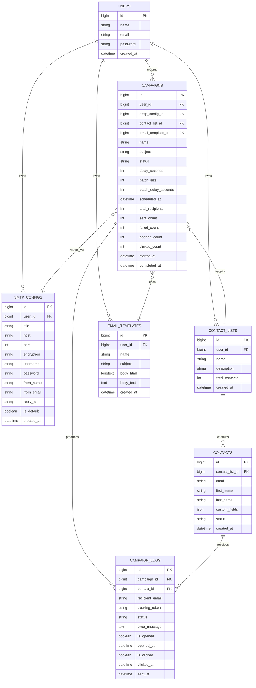

# Implementation Plan: Email Sender & Marketing Platform

An enterprise-grade, high-performance web platform for managing SMTP connections, importing large contact lists (supporting up to 200MB+ CSV files via streaming), designing rich email templates with live previews, and executing scheduled, rate-limited email campaigns with open/click tracking and real-time dashboard analytics.

---

## 1. Executive Summary & Recommended Stack

### Recommended Stack: **Laravel 11 (PHP 8.5) + Tailwind CSS + Alpine.js + SQLite/MySQL + Queue Worker Engine**

#### Why this is the best stack for this platform:
1. **Native XAMPP & CLI Compatibility**: Your environment already has PHP 8.5, Composer 2.8, Node.js 24, and MariaDB/SQLite ready in `/Applications/XAMPP/xamppfiles/htdocs/email_sender`.
2. **Streamed I/O for 200MB CSVs**: Laravel + PHP generators stream massive CSV files row-by-row with minimal memory usage (< 15MB RAM), preventing server memory exhaustion (`memory_limit` errors).
3. **Built-in Queue & Worker Architecture**: Crucial for email campaigns. HTTP web requests should never send thousands of emails directly in a loop. Laravel's queue workers run in the background, handling throttling (e.g., 2-second delay between sends, batch limits per minute), retries, and failure logging.
4. **Symfony Mailer / PHPMailer Integration**: Dynamic runtime SMTP credentials support, SSL/TLS negotiation, custom headers, DKIM support, and test diagnostics.
5. **Modern, Reactive UI**: Tailwind CSS paired with Chart.js and Alpine.js delivers a sleek, responsive dashboard with real-time campaign progress bars, template previews, and interactive charts without heavyweight frontend framework overhead.

---

## 2. System Architecture & Feature Breakdown

---

## 3. Detailed Component Specifications

### A. Authentication & User Management
- **Login & Register**: Secure bcrypt-hashed password authentication with remember-me sessions.
- **Profile & API Keys**: Account settings and SMTP security keys.
- **Middleware Protection**: All dashboard and management endpoints protected against unauthorized access.

### B. Overview Dashboard
- **Top Metric Cards**:
  - Total Emails Sent (Lifetime & Current Month).
  - Total Pending / In-Queue.
  - Total Failed / Bounced.
  - Total Opened & Unique Open Rate (%).
  - Total Clicked & Click-Through Rate (CTR %).
- **Interactive Charts**:
  - Daily sending volume line chart (Last 30 days).
  - Delivery vs. Open rate comparative bar chart.
- **Recent Campaigns & Live Dispatch Table**:
  - Status badge (Draft, Scheduled, Processing, Completed, Paused).
  - Real-time progress bar.

---

### C. SMTP Server Manager & Test Sender
- **Multi-SMTP Support**: Connect multiple SMTP servers (e.g., Amazon SES, SendGrid, Mailgun, Postmark, Google Workspace, or private cPanel/Postfix SMTPs).
- **Fields**:
  - Provider Name / Label (e.g., "Primary SES Relay")
  - Host (e.g., `smtp.mailgun.org`)
  - Port (`587`, `465`, `25`)
  - Encryption (`TLS`, `SSL`, `None`)
  - Username & Password
  - From Name (e.g., `Kawsers Deals`)
  - From Email Address (`news@yourdomain.com`)
  - Reply-To Email Address
  - Daily / Hourly Rate Limit Cap
- **Instant Test Sender Tool**:
  - Input a target email (e.g., `test@example.com`).
  - Sends a diagnostic test email with detailed SMTP handshake logs (Connection, Auth, Delivery status) to verify credentials before launching campaigns.

---

### D. Contact Management & 200MB CSV Stream Importer
- **Contact Lists**: Group contacts into isolated lists (e.g., "Newsletter Subscribers", "E-commerce Leads", "Q3 Outreach").
- **200MB High-Performance CSV Importer**:
  - Handles massive CSV files up to 200MB without memory crashes.
  - Uses chunked background streaming (`League\Csv` or stream reader + generator with batch inserts of 1,000 rows at a time).
  - **Column Auto-Mapping**: Automatically identifies columns (Email, First Name, Last Name, Phone, Company, Custom Attributes).
  - **Deduplication & Sanitization**: Validates email format with RFC rules and filters duplicates against existing list entries.
- **Contact Attributes & Custom Tags**: Store custom JSON metadata per contact for dynamic template variables (`{{first_name}}`, `{{company}}`, `{{custom_1}}`, etc.).
- **Unsubscribe & Blacklist Management**: Global suppression list to ensure unsubscribed recipients never receive subsequent emails.

---

### E. Custom Email Template Builder & Dual Preview
- **WYSIWYG & HTML Editor**:
  - Visual rich-text formatting (Headings, Buttons, Images, Dividers, Call-to-Actions, Colors, Typography).
  - Toggle to Raw HTML code editor for advanced custom templates.
- **Personalization Merge Tags**:
  - Click-to-insert dynamic tags: `{{name}}`, `{{first_name}}`, `{{email}}`, `{{company}}`, `{{unsubscribe_url}}`.
- **Live Dual Preview Engine**:
  - Real-time side-by-side or tabbed preview toggling between **Desktop Screen (1200px)** and **Mobile Screen (375px)**.
  - "Send Test Preview" button to send the rendered template with dummy data to the admin's inbox.

---

### F. Campaign Creation, Delay/Throttle Settings & Dispatch Engine
- **Campaign Creation Flow**:
  1. **General Info**: Campaign Name, Subject Line, Preview Header, Sender Identity.
  2. **SMTP Selection**: Choose which connected SMTP to route through.
  3. **Audience Selection**: Select one or multiple Contact Lists.
  4. **Template Selection**: Choose an existing template or create a new one.
  5. **Sending Controls & Throttling (Anti-Spam Protection)**:
     - **Delivery Time**: Send Immediately vs Schedule for Future Date/Time.
     - **Delay Between Emails**: Set custom wait time between each email (e.g., `500ms`, `2 seconds`, `5 seconds`, `10 seconds`).
     - **Batch Throttling**: E.g., send 50 emails -> pause 60 seconds -> resume, preventing SMTP server IP rate bans.
- **Background Worker Engine**:
  - Uses Laravel Queue Jobs (`SendCampaignEmailJob`) processed sequentially or asynchronously.
  - Real-time campaign tracking: Updates progress percentage, sent count, and error messages on failures.
  - Controls: **Pause**, **Resume**, and **Cancel** active campaigns.

---

### G. Open & Click Tracking Engine
- **Open Tracking**:
  - Generates a unique tracking token for each dispatched email.
  - Embeds an invisible 1x1 transparent PNG pixel (`/track/open/{tracking_token}.png`).
  - When the recipient opens the email, the tracking endpoint records the timestamp, IP address, user-agent, and increments the campaign open counter.
- **Click Tracking**:
  - Automatically wraps all hyperlinks in the email body through a secure redirect endpoint (`/track/click/{tracking_token}?url=...`).
  - Records click timestamps before redirecting the recipient seamlessly to the target URL.
- **One-Click Unsubscribe**:
  - Secure signed unsubscribe link (`/unsubscribe/{token}`) automatically adds the contact to the suppression list.

---

## 4. Database Schema Design

---

## 5. Implementation Roadmap & Milestones

| Step | Phase | Key Deliverables |
|:---|:---|:---|
| **Phase 1** | **Foundation & Project Setup** | Initialize Laravel 11 project, configure database, set up Tailwind CSS & UI layout with responsive sidebar and navigation. |
| **Phase 2** | **Authentication & Dashboard** | User Auth (Login, Register, Logout), Top metric summary cards, Chart.js delivery & open rate analytics. |
| **Phase 3** | **SMTP Configuration & Diagnostics** | Multi-SMTP CRUD, credential validation, dynamic mailer factory, and live SMTP test email sender modal. |
| **Phase 4** | **Contact Management & 200MB CSV Streamer** | Contact lists, streaming chunked CSV parser (memory safe for 200MB+), column header mapper, validation & deduplication. |
| **Phase 5** | **Template Builder & Live Preview** | Rich WYSIWYG + HTML editor, merge tag injector (`{{name}}`, `{{email}}`, etc.), live desktop (1200px) & mobile (375px) responsive preview. |
| **Phase 6** | **Campaign Dispatcher & Delay Engine** | Campaign creation wizard, throttle/delay scheduler (custom seconds wait between emails, batch limits), queue workers, and execution engine. |
| **Phase 7** | **Tracking & Analytics Subsystem** | 1x1 invisible open pixel generator, click tracking redirector, unsubscribe engine, and campaign performance reports. |
| **Phase 8** | **End-to-End Verification** | Unit & feature testing, large CSV import stress test, test SMTP delivery, tracking verification, and UI polish. |

---

## 6. Verification Plan

### Automated Verification
- Run test suite for CSV chunk parser to confirm memory usage < 30MB on large datasets.
- Test SMTP connection handler with mock SMTP server.
- Test tracking pixel endpoints and click redirection with token validation.

### Manual Verification
1. **Auth Flow**: Register new user, log in, verify session persistence.
2. **SMTP Setup**: Add SMTP credentials, run "Send Test Email", verify arrival in test inbox.
3. **CSV Import**: Upload a CSV file with 10,000+ contacts, check column mapping and instant import.
4. **Template Building**: Build a template with dynamic merge tags, verify desktop and mobile preview render correctly.
5. **Campaign Execution**: Create campaign, set a 2-second delay between emails, launch, and observe real-time progress bar updating.
6. **Analytics Verification**: Open the received email, check if Dashboard and Campaign stats update to "Opened" immediately.

---

> [!IMPORTANT]
> **User Review Required**:
> Please review this comprehensive architecture and plan. Once you click **Proceed** or approve the plan, we will start building the complete platform step-by-step!
